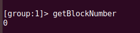
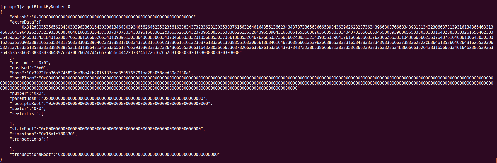
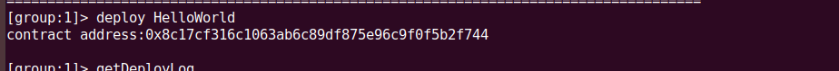
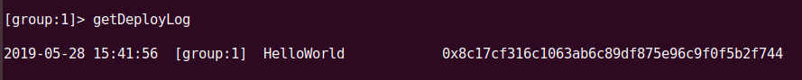
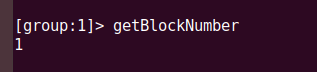
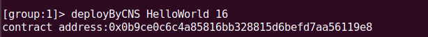
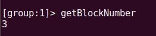
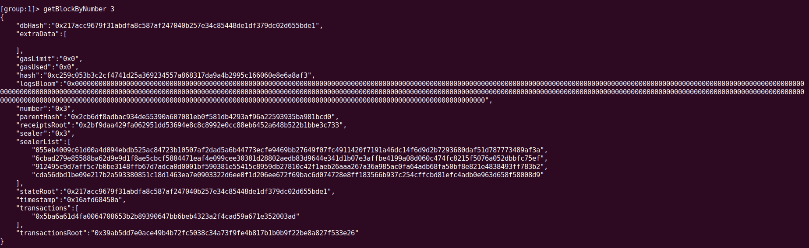

## 课后作业

### 新建链练习步骤

#### 1. 获取创建脚本并且赋予权限
```
curl -LO https://raw.githubusercontent.com/FISCO-BCOS/FISCO-BCOS/master/tools/build_chain.sh && chmod u+x build_chain.sh
```

#### 2. 调用脚本并创建四个结点
```
bash build_chain.sh -l "127.0.0.1:4" -p 30300,20200,8545
```

#### 3. 唤起这四个结点
```
./nodes/127.0.0.1/start_all.sh
```

#### 4. 查看输出日志
```
tail -f nodes/10.0.2.15/node*/log/log_2019052811.57.log |grep ++
```

#### 5. 暂停四个结点
```
./nodes/127.0.0.1/stop_all.sh
```

### build_chain脚本理解报告

#### 脚本功能
- 用于快速生成一条链中的节点。
- 可以使用`-l`指定节点的IP和数目。`-f`指定配置文件。**这两个选项不可共存。**


### 控制台练习

#### 1. 查看区块高度
使用`getBlockNumber`查看区块高度<br>


#### 2. 获取区块数据
由于区块高度为0，因此使用`getBlockByNumber 0`查看区块数据<br>


#### 3. 部署HelloWorld智能合约
HelloWorld合约默认配置在`solidity/contracts`里，在控制台可以直接部署。<br>


#### 4. 使用查看getDeployLog
<br>

#### 5. 调用智能合约
使用`call`方法调用合约，调用时要使用之前部署的HelloWorld地址。<br>


#### 6. 再次查看区块高度
再次查看高度时，因为已经部署了一个合约，所以高度为1。<br>


#### 7. 获取区块数据
查看block 1内的区块数据。<br>


#### 8. 按CNS方式部署HelloWorld智能合约
使用CNS部署的话，可以不用保存那个20位的地址，只需要使用合约名和版本号即可。<br>


#### 9. 再次查看区块高度
再次查看高度是，区块高度是3。（不懂）<br>


#### 10. 获取区块数据
查看区块3的数据。<br>

