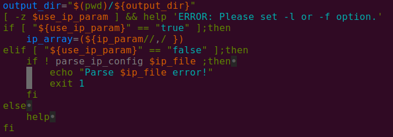
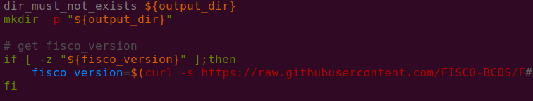
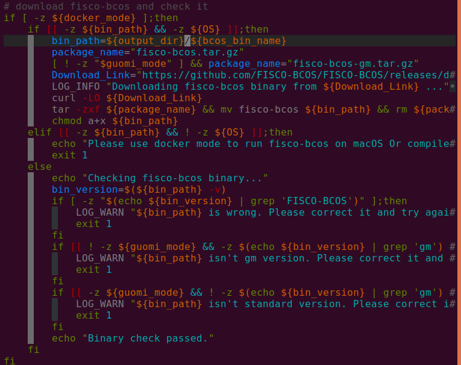
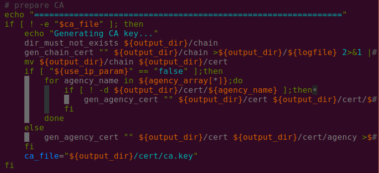
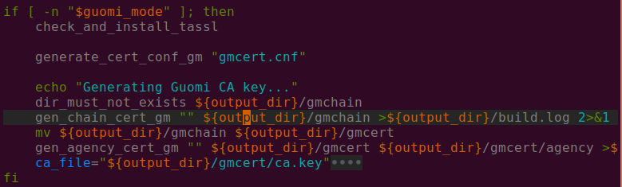
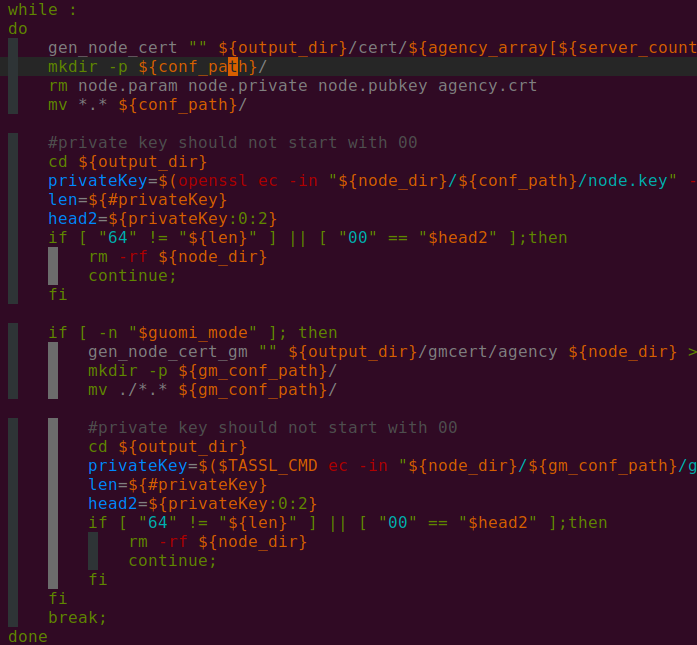

## build_chain.sh脚本分析

### 脚本功能简介
build_chain.sh脚本用于快速生成一条链中节点的配置文件，脚本依赖于openssl。

### 基本使用
- 使用`-l`选项指定节点IP和数目，或使用`-f`选项使用一个指定格式的配置文件。`-l`和`-f`必须且只能使用其中一个。
- 测试时用可`-T`或`-i`选项。`-T`选项开启log级别到DEBUG，`-i`选项设置RPC和channel监听`0.0.0.0`，p2p模块默认监听`0.0.0.0`。

### main()主函数分析

- `build_chain.sh`脚本里的`parse_params()`方法会解析各命令选项。具体各选项命令可以查看脚本里的`help()`方法块。
```
Usage:
    -l <IP list>                        [Required] "ip1:nodeNum1,ip2:nodeNum2" e.g:"192.168.0.1:2,192.168.0.2:3"
    -f <IP list file>                   [Optional] split by line, every line should be "ip:nodeNum agencyName groupList". eg "127.0.0.1:4 agency1 1,2"
    -e <FISCO-BCOS binary path>         Default download fisco-bcos from GitHub. If set -e, use the binary at the specified location
    -o <Output Dir>                     Default ./nodes/
    -p <Start Port>                     Default 30300,20200,8545 means p2p_port start from 30300, channel_port from 20200, jsonrpc_port from 8545
    -i <Host ip>                        Default 127.0.0.1. If set -i, listen 0.0.0.0
    -v <FISCO-BCOS binary version>      Default get version from FISCO-BCOS/blob/master/release_note.txt. eg. 2.0.0
    -d <docker mode>                    Default off. If set -d, build with docker
    -s <State type>                     Default storage. if set -s, use mpt 
    -S <Storage type>                   Default leveldb. if set -S, use external
    -c <Consensus Algorithm>            Default PBFT. If set -c, use Raft
    -C <Chain id>                       Default 1. Can set uint.
    -g <Generate guomi nodes>           Default no
    -z <Generate tar packet>            Default no
    -t <Cert config file>               Default auto generate
    -T <Enable debug log>               Default off. If set -T, enable debug log
    -F <Disable log auto flush>         Default on. If set -F, disable log auto flush
    -h Help
e.g
    ./tools/build_chain.sh -l "127.0.0.1:4"
```
- 脚本会先根据命令选项`-l`或`-f`判断是使用命令输入的节点IP还是使用配置配置文件生成节点。

- 随后检测输出文件目录是否存在，以及fisco版本情况。

- 然后检查运行环境是否在docker下以及操作系统情况，下载fisco-bcos。

- 再根据命令输入的节点信息或配置文件调用`gen_chain_cert()`方法生成链的证书。

- 再调用`gen_agency_cert()`方法生成机构证书。

- 之后调用`gen_node_cert()`方法生成节点证书。

- 最后调用`print_result()`方法输出结果信息。
