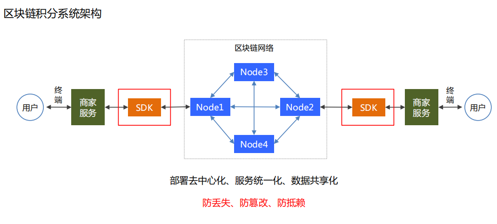
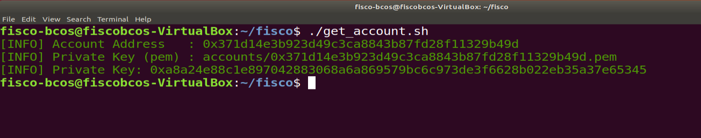
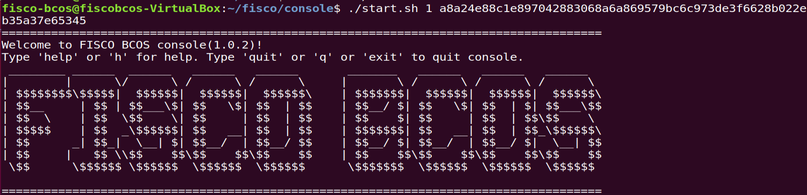
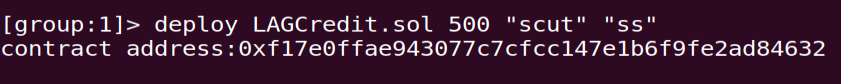
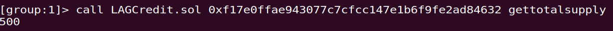
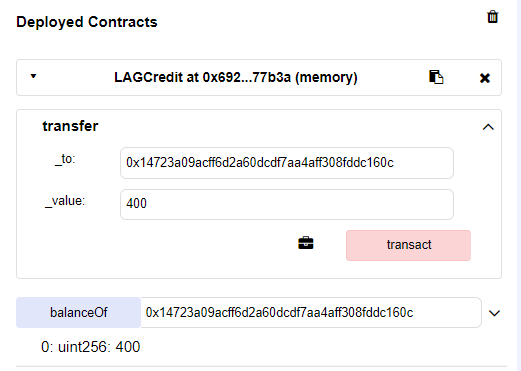

# day2——第一次周报

## 本周工作

### 积分系统的介绍
- 通过区块链发放一定额度的积分
- 通过首次消费获取一定量的积分
- 每次按消费金额也可以获得相应的积分
- 积分可在消费时抵扣金额
- 积分可以相互转换

### 区块链积分系统结构

### LAG合约的编写
[源代码在这](https://github.com/webanklabgroup5/webank/blob/master/day2/%E5%88%98%E6%B5%A9%E9%BE%99/ballot.sol)

### LAG合约在控制台的部署和调用
1. 创建第一个用户

2. 使用第一个用户的私钥登录控制台

3. 部署合约，并创建500个scut积分。

4. 获取总积分数

5. 转积分到另一个用户中，并查看该用户余额。

