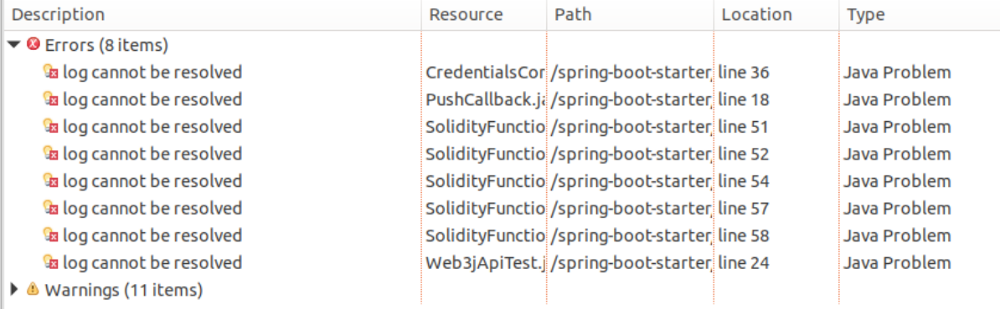
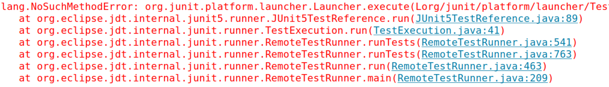

# 第三周周报

>
本次作业： 
1. 用[僵尸游戏](https://cryptozombies.io/en/lesson)熟悉[solidity](https://solidity.readthedocs.io/en/v0.5.9)规则  
2. 使用[spring-boot-starter](https://github.com/FISCO-BCOS/spring-boot-starter/blob/master/doc/README_CN.md)部署课上的[LAG积分合约](LAGCredit.sol) 

## 已完成
* solidity规则：[solidity](solidity.md) 
* 使用控制台部署LAG积分合约：[LAG积分合约实验](LAG积分合约实验.md)

## 未完成
使用spring-boot-starter部署LAG积分合约

* 调试中...ContractTest.java -> Run As -> JUnit Test
* Problems 
* Console 

