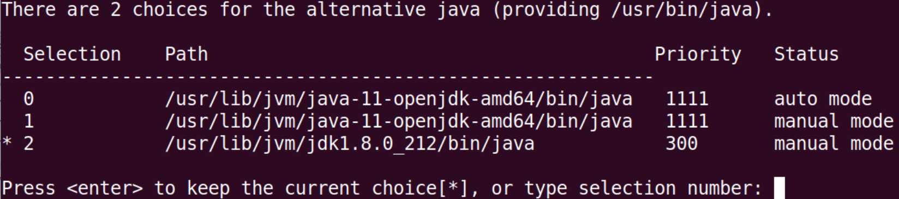
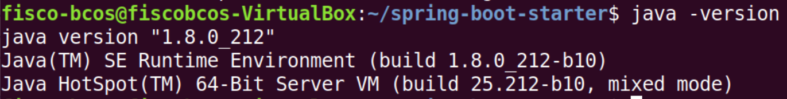
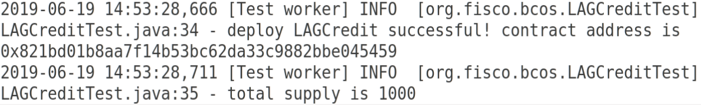
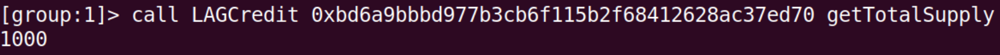

# 第四周周报

## 使用spring-boot-starter部署LAG积分合约
spring-boot直接Gradle Test<br>
默认版本的jdk11在Gradle Test会出现compile错误<br>
因此装了jdk8

## jdk8安装
参考文章：[Ubuntu 安装JDK8 的两种方式](https://cloud.tencent.com/developer/article/1052064), 他装的是

### 1.官网下载JDK
我是从github上下的(oracle账号不记得了...)<br>
[jdk-8u212-linux-x64.tar.gz](https://github.com/frekele/oracle-java/releases/download/8u212-b10/jdk-8u212-linux-x64.tar.gz)

### 2.解压缩放到指定目录
创建目录：(这一步可以不用做，因为jdk11也在这个目录下)
```bash
sudo mkdir /usr/lib/jvm
```

解压缩到该目录
```bash
sudo tar -zxvf jdk-8u212-linux-x64.tar.gz -C /usr/lib/jvm
```

### 3.修改环境变量
```bash
sudo vim ~/.bashrc
```
文件末尾追加下面内容
```bash
#set oracle jdk environment
export JAVA_HOME=/usr/lib/jvm/jdk1.8.0_212  ## 这里要注意目录要换成自己解压的jdk 目录
export JRE_HOME=${JAVA_HOME}/jre  
export CLASSPATH=.:${JAVA_HOME}/lib:${JRE_HOME}/lib  
export PATH=${JAVA_HOME}/bin:$PATH
```
使环境变量马上生效
```bash
source ~/.bashrc
```

### 4.设置系统默认jdk版本
```bash
sudo update-alternatives --install /usr/bin/java java /usr/lib/jvm/jdk1.8.0_212/bin/java 300  
sudo update-alternatives --install /usr/bin/javac javac /usr/lib/jvm/jdk1.8.0_212/bin/javac 300  
sudo update-alternatives --install /usr/bin/jar jar /usr/lib/jvm/jdk1.8.0_212/bin/jar 300   
sudo update-alternatives --install /usr/bin/javah javah /usr/lib/jvm/jdk1.8.0_212/bin/javah 300   
sudo update-alternatives --install /usr/bin/javap javap /usr/lib/jvm/jdk1.8.0_212/bin/javap 300   
```
然后执行
```bash
sudo update-alternatives --config java
```


### 5.测试jdk
```bash
java -version
```


## 部署LAG积分合约

### 1.生成`.java`文件
把[LAGCredit.sol](LAGCredit.sol)放到`spring-boot-starter`的`src/test/resources/contract`目录下，gradlew build一遍。

* `src/test/resources/solidity`目录下会生成相应的`.abi`和`.bin`(二进制文件)<br>
* `src/test/java/org/fisco/bcos/temp`目录下下会产生`.java`文件

### 2.编写测试用例
在`src/test/java/org/fisco/bcos`目录下新建[LAGCreditTest.java](LAGCreditTest.java)文件，核心内容如下
```java
@Test 
public void deloy() throws Exception {
	// deploy contract
	LAGCredit bookStore = LAGCredit.deploy(
			web3j, credentials, 
			new StaticGasProvider(GasConstants.GAS_PRICE,GasConstants.GAS_LIMIT),
			BigInteger.valueOf(1000), "SCUT", "simon")
									.send();
	if(bookStore != null) {
		log.info("deploy LAGCredit successful! contract address is {}", bookStore.getContractAddress());
		log.info("total supply is {}",bookStore.getTotalSupply().send());
	}
}
```
我是使用eclipse运行的Gradle Test<br>
完毕后可以在`spring-boot-starter/logs`目录下查看`info*.log`,控制台也能访问<br>

日志文件截取


控制台访问
