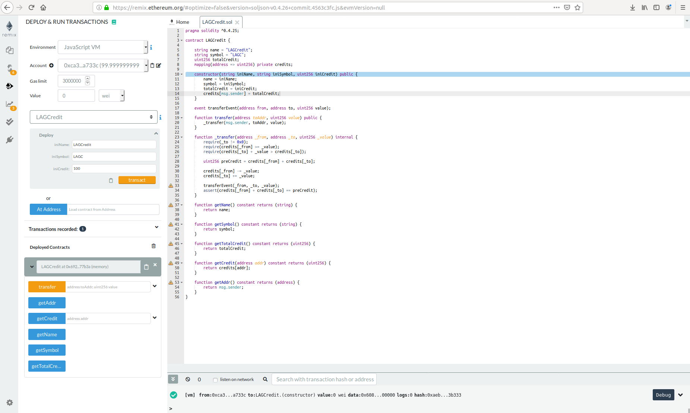
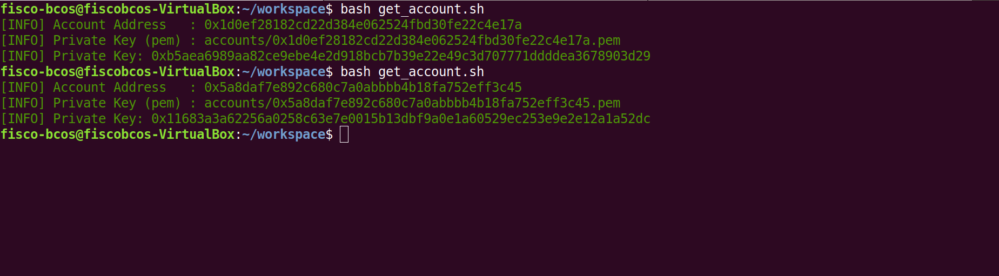
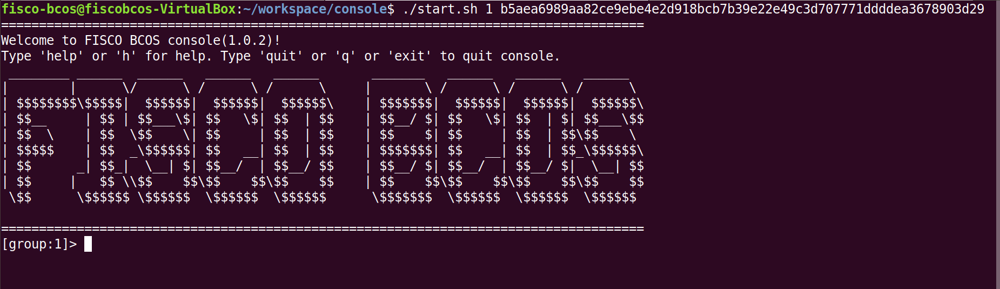
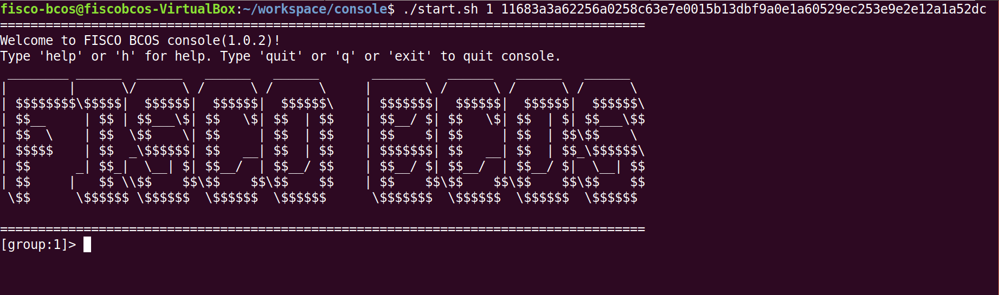
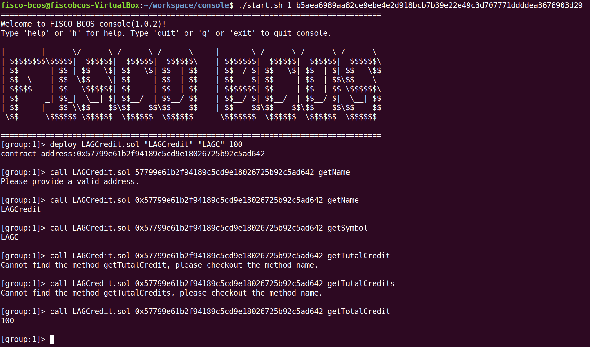
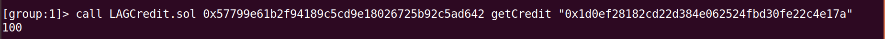
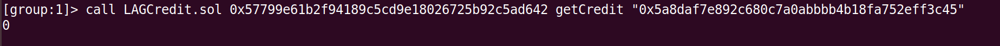
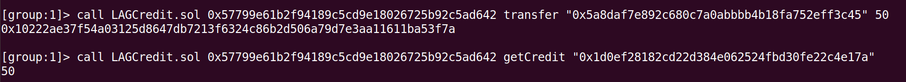
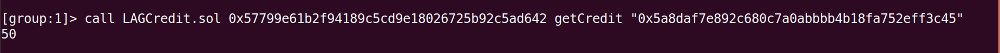
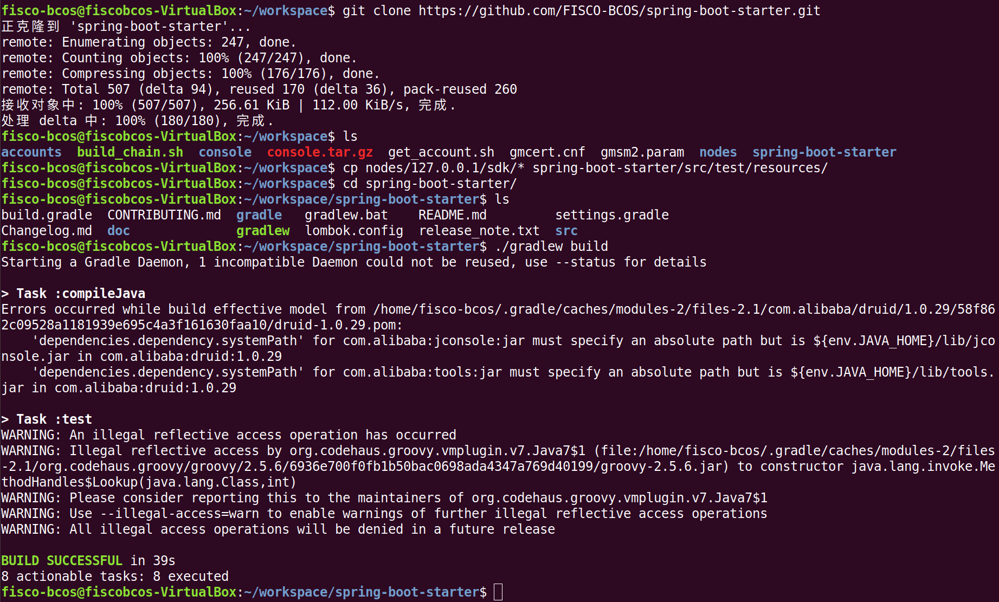

## LAG积分智能合约部署实验

### 实验介绍
本次实验内容主要是实现一个积分系统，该系统主要模拟商家发放积分、用户消费积分等功能。主要功能如下：
1. 系统初始化
2. 系统名称、简称查询
3. 系统总积分查询
4. 根据地址查询用户积分
5. 积分交易

### 实验过程
#### 1. 在remix网站编写并测试[智能合约](https://github.com/webanklabgroup5/webank/blob/master/day2/祝鹏富/LAGCredit.sol)

#### 2. 在终端利用FISCO-BCOS控制台部署合约
- 用get_account.sh脚本生成两个账户，一个作为发放积分的商家，另一个作为消费积分的用户

- 利用两个账户私钥登录FISCO-BCOS控制台（前者为商家，后者为用户）

- 商家初始化系统，发布积分，并检查系统是否正常

- 查看积分交易前商家和用户积分

- 商家下放50积分给用户，交易完成后查看商家和用户积分

#### 3. 利用spring-boot-starter尝试sdk配置
