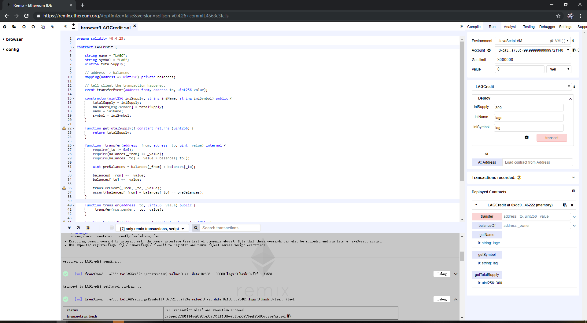
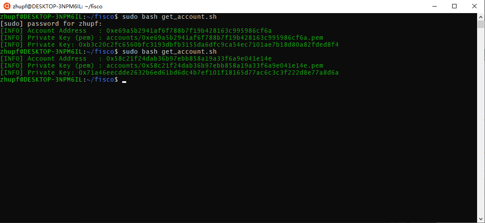
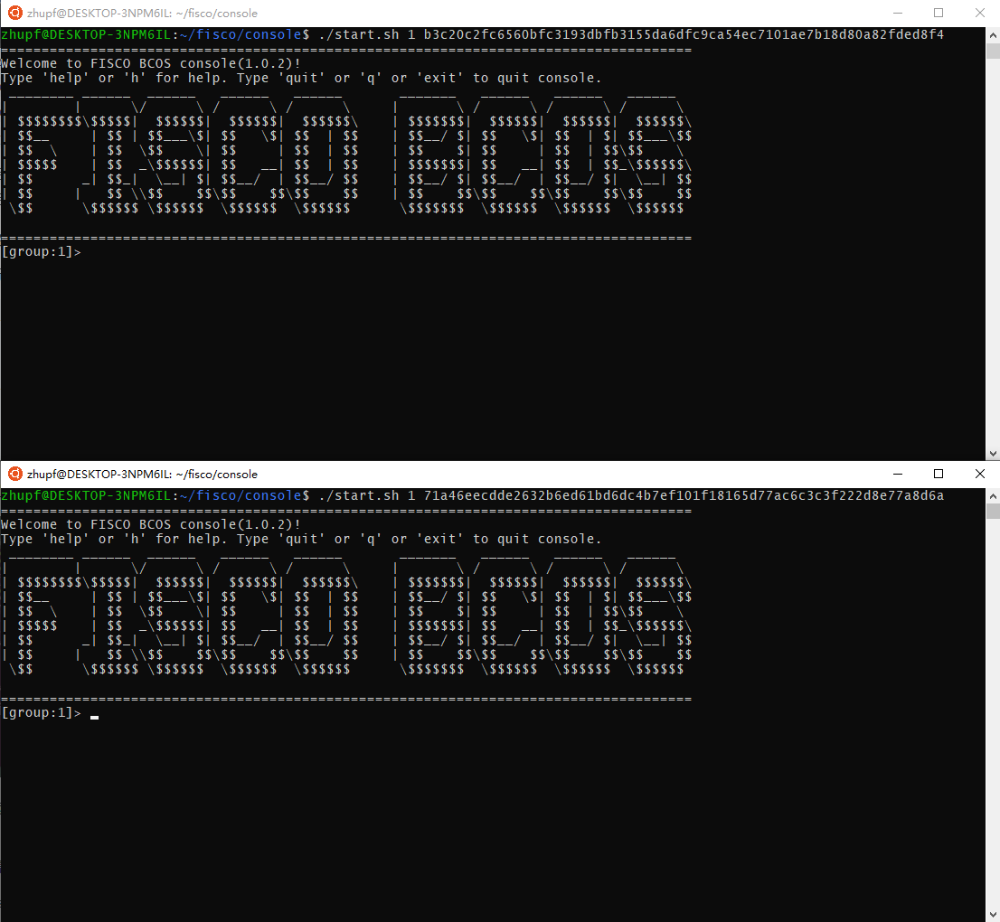
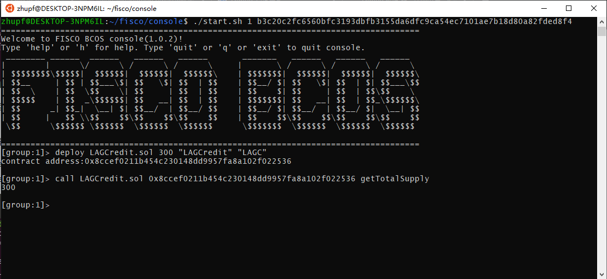
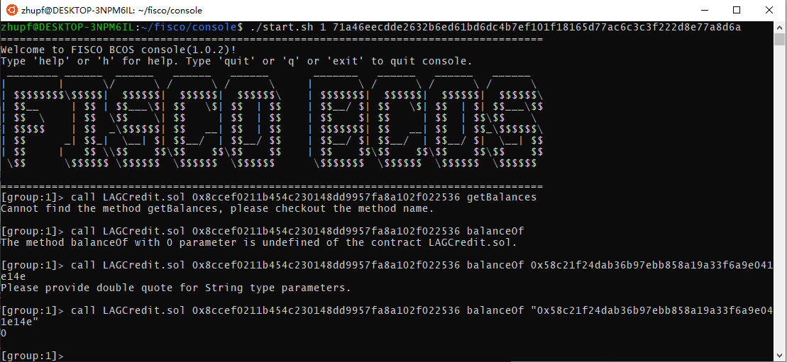
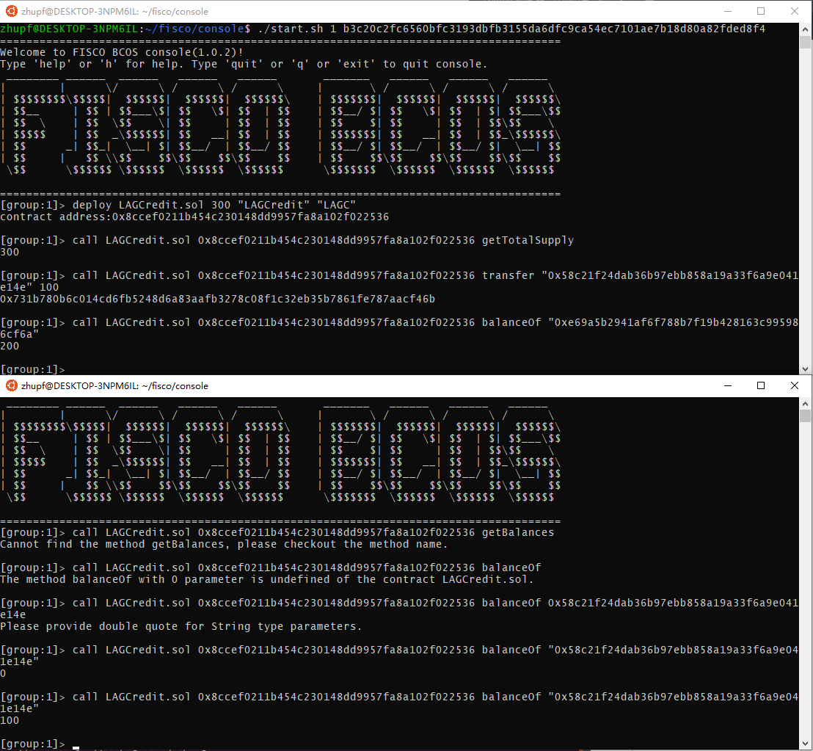

## 课后作业

## 基于区块链的积分系统
### 实验介绍
本次实验内容主要是实现一个积分系统，由商家进行积分的发放（积分总量固定），用户利用获取的积分进行消费。
积分系统提供的功能：
1. 系统初始化（积分初始化）；
2. 积分总量查询；
3. 获取积分系统名字；
4. 获取积分系统简称；
5. 用户积分查询；
6. 积分转账；

### 实验过程
#### 1. 在remix网站编写并测试[智能合约]()

#### 2. 在终端操作
- 用get_account.sh生成两个账户，一个作为发行积分的商家用户，一个作为消费积分的普通用户。

- 利用两个账户的私钥登录控制台，前者作为商家，后者作为普通用户。

- 利用商家账户部署智能合约，并查看积分总量是否正确。

- 查看用户积分余额

- 商家转账100积分给用户，输出转账后商家积分余额、用户积分余额以及积分总量。
