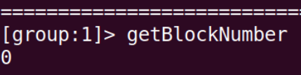
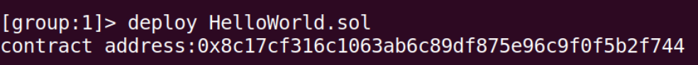
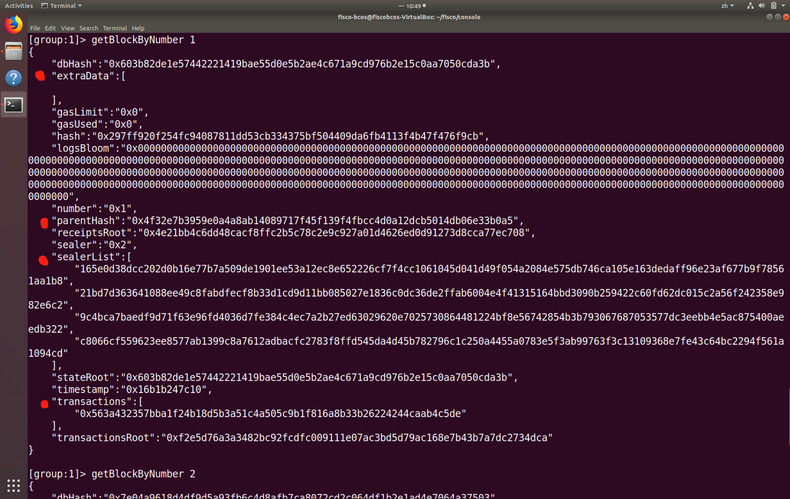
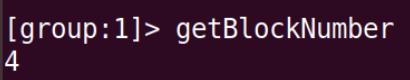

### 控制台练习

#### 1. 查看区块高度
使用`getBlockNumber` 

#### 2. 获取区块数据
由于目前区块高度为0，`getBlockByNumber 0` 
可以看到区块数据有：`hash`,`number`,`transactions`等共15个字段 

#### 3. 部署HelloWorld智能合约
部署位于solidity/contract下的智能合约HelloWorld.sol 

#### 4. 使用查看getDeployLog
 

#### 5. 调用智能合约
运行call，调用合约：
> 
* 合约名称：部署的合约名称(可以带.sol后缀)。 
* 合约地址: 部署合约获取的地址，合约地址可以省略前缀0，例如，0x000ac78可以简写成0xac78。 
* 合约接口名：调用的合约接口名。 
* 参数：由合约接口参数决定。参数由空格分隔，其中字符串、字节类型参数需要加上双引号；数组参数需要加上中括号，比如[1,2,3]，数组中是字符串或字节类型，加双引号，例如[“alice”,”bob”]；布尔类型为true或者false。  

可以看到，get方法不改变区块高度，set方法改变区块高度。

#### 6. 再次查看区块高度
因为已经部署了1个合约，以及调用了一次call的set方法，所以高度为2。见上图 

#### 7. 获取区块数据
查看block 1内的区块数据。 

可以看到`extraData`字段的数据没有了
父哈希`parentHash`为block 0的地址
`sealerList`，`transactions`也有了内容

#### 8. 按CNS方式部署HelloWorld智能合约
`deployByCNS` + 合约名称 + 版本号 

#### 9. 再次查看区块高度
?? CNS方法部署多了2个区块 

#### 10. 获取区块数据

